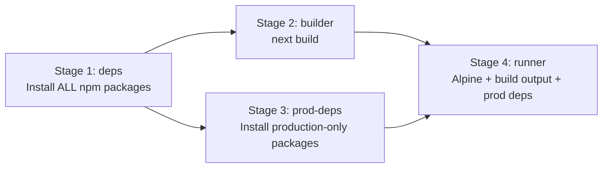
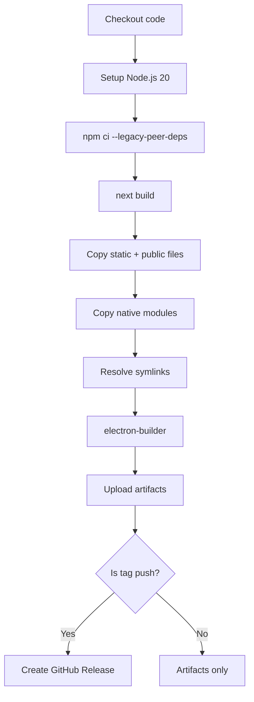
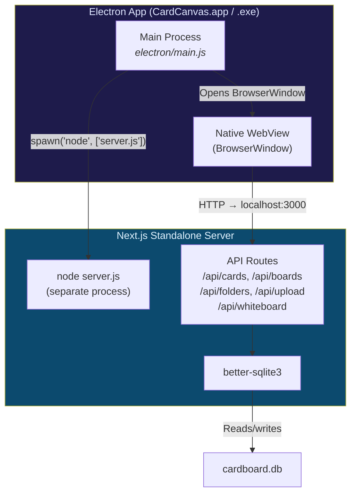
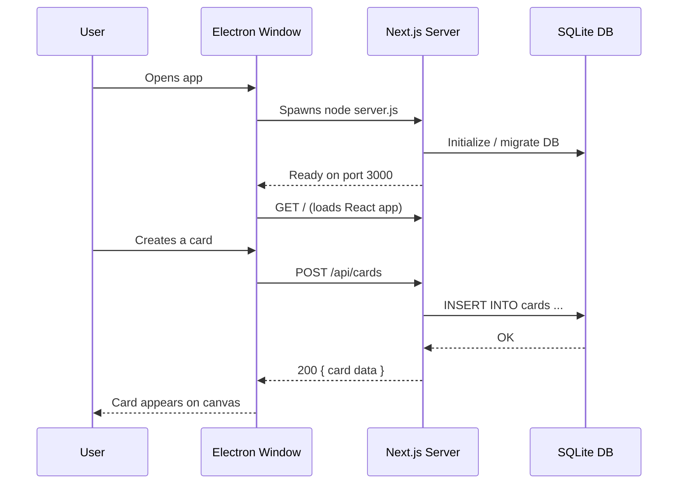
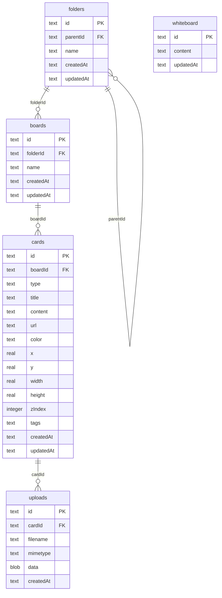

# CardCanvas — Complete Build & Deployment Guide

> A visual workspace for organizing cards, notes, links, and media on an infinite canvas.  
> Built with Next.js 16, React 19, TipTap, Excalidraw, and SQLite.

---

## Table of Contents

1. [Project Overview](#1-project-overview)
2. [Prerequisites](#2-prerequisites)
3. [Local Development](#3-local-development)
4. [Production Build (Local Server)](#4-production-build-local-server)
5. [Docker Deployment](#5-docker-deployment)
6. [Desktop App — macOS (.dmg)](#6-desktop-app--macos-dmg)
7. [Desktop App — Windows (.exe)](#7-desktop-app--windows-exe)
8. [Automated CI/CD with GitHub Actions](#8-automated-cicd-with-github-actions)
9. [Architecture Deep Dive](#9-architecture-deep-dive)
10. [Project File Structure](#10-project-file-structure)
11. [Troubleshooting](#11-troubleshooting)

---

## 1. Project Overview

CardCanvas is a self-hosted infinite whiteboard where every sticky note is a card. It supports:

- 📝 **Rich Text Cards** — Full WYSIWYG editor with tables, task lists, formatting
- 🔗 **Link Cards** — Bookmark and preview URLs
- 🖼️ **Image Cards** — Upload or embed images
- 📄 **PDF Cards** — Embed and preview PDFs
- 🎨 **14-Color Palette** — Organize cards visually
- 🔍 **Search, Tags & Calendar Filtering** — Find anything fast
- 📁 **Folders & Boards** — Hierarchical workspace organization
- 🖌️ **Excalidraw Whiteboard** — Built-in drawing canvas
- 📦 **Runs anywhere** — Web, Docker, macOS, Windows

### Tech Stack

| Layer | Technology |
|-------|-----------|
| Frontend | React 19, Next.js 16, TipTap (WYSIWYG), Excalidraw |
| Backend | Next.js API Routes (Node.js) |
| Database | SQLite via better-sqlite3 |
| Styling | Vanilla CSS (dark theme, glassmorphism) |
| Desktop | Electron 42 + electron-builder |
| Container | Docker (Alpine-based multi-stage) |

---

## 2. Prerequisites

| Tool | Version | Required For |
|------|---------|-------------|
| **Node.js** | 18+ (recommended 20) | All builds |
| **npm** | 9+ | All builds |
| **Docker** | 20+ | Docker deployment only |
| **Git** | Any | Source control |

### Install Node.js

```bash
# macOS (Homebrew)
brew install node@20

# Windows (Download)
# https://nodejs.org/en/download/

# Verify
node --version   # v20.x.x
npm --version    # 10.x.x
```

---

## 3. Local Development

This is the fastest way to run CardCanvas for development.

### Step 1: Clone and install

```bash
git clone https://github.com/YOUR_USERNAME/cardcanvas.git
cd cardcanvas
npm install --legacy-peer-deps
```

> [!NOTE]
> `--legacy-peer-deps` is needed because some TipTap extensions have minor peer dependency version mismatches (3.22.4 vs 3.22.5). They work fine together.

### Step 2: Start the dev server

```bash
npm run dev
```

Output:
```
▲ Next.js 16.2.4 (Turbopack)
- Local:         http://localhost:3000
✓ Ready in 514ms
```

### Step 3: Open in browser

Go to **http://localhost:3000** — the app is running with hot reload.

### Where is data stored?

| Item | Location |
|------|----------|
| Database | `./data/cardboard.db` |
| Uploaded media | Stored as BLOBs in the database |

> [!TIP]
> The `data/` directory is gitignored. Your cards and uploads are local to your machine.

---

## 4. Production Build (Local Server)

Use this to run a production-optimized version on your machine or a server.

### Step 1: Build

```bash
npm run build
```

Output:
```
▲ Next.js 16.2.4 (Turbopack)
✓ Compiled successfully in 5.6s
✓ Generating static pages (9/9) in 322ms

Route (app)
┌ ○ /
├ ○ /_not-found
├ ƒ /api/boards
├ ƒ /api/cards
├ ƒ /api/folders
├ ƒ /api/upload
└ ƒ /api/whiteboard
```

### Step 2: Run the standalone server

Since the project uses `output: 'standalone'` in `next.config.ts`, the build produces a self-contained server:

```bash
# Copy static files (required one-time after each build)
cp -R .next/static .next/standalone/.next/static
cp -R public .next/standalone/public

# Start the server
PORT=3000 HOSTNAME=0.0.0.0 node .next/standalone/server.js
```

Output:
```
▲ Next.js 16.2.4
- Local: http://0.0.0.0:3000
✓ Ready in 0ms
```

> [!WARNING]
> Don't use `npm run start` (i.e. `next start`) with `output: 'standalone'`. Use `node .next/standalone/server.js` instead. Next.js will warn about this.

---

## 5. Docker Deployment

Docker is the recommended way to deploy CardCanvas on a server.

### Option A: Docker Compose (recommended)

```bash
docker compose up -d
```

That's it! The app is at **http://localhost:3000**.

#### What `docker-compose.yml` does:

```yaml
services:
  cardcanvas:
    build: .
    ports:
      - "3000:3000"
    volumes:
      - cardcanvas-data:/app/data    # Persist database
    restart: unless-stopped
    environment:
      - NODE_ENV=production

volumes:
  cardcanvas-data:                   # Named volume for persistence
```

### Option B: Manual Docker build

```bash
# Build the image
docker build -t cardcanvas .

# Run it
docker run -d \
  --name cardcanvas \
  -p 3000:3000 \
  -v cardcanvas-data:/app/data \
  --restart unless-stopped \
  cardcanvas
```

### How the Dockerfile works

The Dockerfile uses a **4-stage multi-stage build** for minimal image size:



| Stage | Purpose | What's copied forward |
|-------|---------|----------------------|
| `deps` | Install all dependencies (including devDeps) | node_modules → builder |
| `builder` | Run `next build` | `.next/`, `public/`, `package.json`, `next.config.ts` |
| `prod-deps` | Install production-only deps | `node_modules` (no devDeps) |
| `runner` | Final image | Everything needed to run |

### Docker data persistence

| Volume | Container Path | Contents |
|--------|---------------|----------|
| `cardcanvas-data` | `/app/data` | `cardboard.db` (SQLite database) |

### Useful Docker commands

```bash
# View logs
docker compose logs -f

# Stop
docker compose down

# Rebuild after code changes
docker compose up -d --build

# Backup the database
docker cp cardcanvas:/app/data/cardboard.db ./backup.db

# Access the database directly
docker exec -it cardcanvas sh
```

> [!CAUTION]
> Never delete the `cardcanvas-data` volume without backing up first — it contains all your cards, boards, folders, and uploaded files.

---

## 6. Desktop App — macOS (.dmg)

### Prerequisites

- Node.js 20+ installed
- macOS 12+ (Monterey or later)

### Quick build

```bash
npm run electron:build
```

This runs [electron/build.js](file:///Users/mann/Documents/card%20canvas/cardcanvas/electron/build.js) which automates all 5 steps below.

### Manual step-by-step build

#### Step 1: Build Next.js

```bash
npm run build
```

#### Step 2: Copy static assets into standalone

```bash
cp -R .next/static .next/standalone/.next/static
cp -R public .next/standalone/public
```

#### Step 3: Copy native modules

The standalone output doesn't include `better-sqlite3` (a C++ native module), so copy it manually:

```bash
cp -R node_modules/better-sqlite3 .next/standalone/node_modules/better-sqlite3
cp -R node_modules/bindings .next/standalone/node_modules/bindings
cp -R node_modules/file-uri-to-path .next/standalone/node_modules/file-uri-to-path
```

#### Step 4: Resolve symlinks

Next.js standalone creates symlinks that electron-builder can't follow inside `.app` bundles:

```bash
find .next/standalone -type l | while read link; do
  target=$(readlink "$link")
  resolved=$(cd "$(dirname "$link")" && realpath "$target" 2>/dev/null || echo "")
  if [ -n "$resolved" ] && [ -e "$resolved" ]; then
    rm "$link"
    cp -R "$resolved" "$link"
    echo "Resolved: $link"
  fi
done
```

#### Step 5: Package with electron-builder

```bash
npx electron-builder --mac --config electron-builder.yml
```

#### Output

```
dist/CardCanvas-1.0.0-mac-arm64.dmg    (119 MB)
```

### Install

1. Double-click the `.dmg` file
2. Drag **CardCanvas** to your **Applications** folder
3. Launch from Applications or Spotlight

### Where is data stored?

```
~/Library/Application Support/CardCanvas/data/cardboard.db
```

---

## 7. Desktop App — Windows (.exe)

### Option A: Build on Windows (recommended)

If you have a Windows machine:

```powershell
# Clone and install
git clone https://github.com/YOUR_USERNAME/cardcanvas.git
cd cardcanvas
npm install --legacy-peer-deps

# Build Next.js
npx next build

# Copy static files
xcopy /E /I .next\static .next\standalone\.next\static
xcopy /E /I public .next\standalone\public

# Copy native modules
xcopy /E /I node_modules\better-sqlite3 .next\standalone\node_modules\better-sqlite3
xcopy /E /I node_modules\bindings .next\standalone\node_modules\bindings

# Package
npx electron-builder --win --config electron-builder.yml
```

Output:
```
dist\CardCanvas-Setup-1.0.0.exe    (~103 MB)
```

### Option B: Cross-compile from macOS

You can build the Windows `.exe` from macOS (electron-builder uses Wine internally):

```bash
npx electron-builder --win --config electron-builder.yml
```

> [!WARNING]
> Cross-compiled `.exe` files contain macOS-compiled `better-sqlite3` native binaries. The Electron shell works, but the database **will not work** on Windows. For a fully working Windows build, use Option A or the GitHub Actions CI/CD (Section 8).

### Option C: GitHub Actions (best for distribution)

Push a version tag to trigger automated builds on actual Windows runners — see [Section 8](#8-automated-cicd-with-github-actions).

### Install on Windows

1. Run `CardCanvas-Setup-1.0.0.exe`
2. Choose install directory (default: `C:\Users\<name>\AppData\Local\Programs\CardCanvas`)
3. Launch from Start Menu or Desktop shortcut

### Where is data stored?

```
C:\Users\<name>\AppData\Roaming\CardCanvas\data\cardboard.db
```

---

## 8. Automated CI/CD with GitHub Actions

The project includes a GitHub Actions workflow at [`.github/workflows/build-desktop.yml`](file:///Users/mann/Documents/card%20canvas/cardcanvas/.github/workflows/build-desktop.yml) that builds **all platforms natively**.

### How to trigger a release

```bash
# Tag a version
git tag v1.0.0
git push origin v1.0.0
```

### What it builds

| Runner | Platform | Output |
|--------|----------|--------|
| `macos-14` (M1) | macOS arm64 | `CardCanvas-1.0.0-mac-arm64.dmg` |
| `macos-13` (Intel) | macOS x64 | `CardCanvas-1.0.0-mac-x64.dmg` |
| `windows-latest` | Windows x64 | `CardCanvas-Setup-1.0.0.exe` |
| `ubuntu-latest` | Linux x64 | `CardCanvas-1.0.0-linux.AppImage` |

### Workflow steps (per platform)



### Manual trigger

You can also run the workflow manually from the GitHub Actions tab → **"Build Desktop Apps"** → **"Run workflow"**.

> [!IMPORTANT]
> The workflow uses `${{ secrets.GITHUB_TOKEN }}` for creating releases. This is automatically provided by GitHub — no configuration needed.

---

## 9. Architecture Deep Dive

### How the Desktop App Works



**Why this architecture?**

| Decision | Reason |
|----------|--------|
| Separate Node.js process | `better-sqlite3` is a C++ native module compiled for Node.js. Electron's V8 has breaking API changes that make it incompatible. Running a separate `node` process avoids this entirely. |
| `output: 'standalone'` | Produces a self-contained `server.js` (~7KB) that bundles all traced dependencies. No `node_modules` needed at runtime (except native modules). |
| `npmRebuild: false` | Prevents electron-builder from trying to rebuild `better-sqlite3` for Electron's V8 (which fails). |
| System `node` binary | The packaged app runs `node` from the user's PATH. This is simpler than bundling Node.js inside the app. |

### Data Flow



### Database Schema



---

## 10. Project File Structure

```
cardcanvas/
├── .github/
│   └── workflows/
│       └── build-desktop.yml     # CI/CD for multi-platform builds
├── build/
│   └── icon.png                  # App icon (used by electron-builder)
├── electron/
│   ├── main.js                   # Electron main process
│   ├── preload.js                # Context bridge (security)
│   └── build.js                  # Automated build script
├── public/                       # Static assets
├── src/
│   ├── app/
│   │   ├── globals.css           # All styles (1400+ lines)
│   │   ├── layout.tsx            # Root layout
│   │   └── page.tsx              # Main page
│   ├── components/
│   │   ├── Canvas/               # Infinite canvas with cards
│   │   ├── Editor/               # TipTap rich text editor
│   │   ├── Sidebar/              # Workspace navigation
│   │   └── Whiteboard/           # Excalidraw integration
│   ├── lib/
│   │   ├── constants.ts          # Color palette, config
│   │   └── db.ts                 # SQLite database layer
│   └── types/
│       └── index.ts              # TypeScript interfaces
├── Dockerfile                    # Multi-stage Docker build
├── docker-compose.yml            # One-command Docker deployment
├── electron-builder.yml          # Desktop packaging config
├── next.config.ts                # Next.js configuration
├── package.json                  # Dependencies & scripts
└── tsconfig.json                 # TypeScript config
```

---

## 11. Troubleshooting

### "Port 3000 is in use"

```bash
# Find what's using port 3000
lsof -i :3000

# Kill it
kill -9 <PID>

# Or use a different port
PORT=3001 npm run dev
```

### npm install fails with peer dependency errors

```bash
npm install --legacy-peer-deps
```

This is caused by TipTap table extensions (3.22.5) having a slightly newer peer dep than other TipTap packages (3.22.4).

### Docker build fails on Apple Silicon

Make sure you're using `node:20-alpine` (supports arm64). If building for a different architecture:

```bash
docker build --platform linux/amd64 -t cardcanvas .
```

### Electron app shows blank window

1. Make sure the Next.js dev server is running first (`npm run dev`)
2. Then launch Electron: `npm run electron:dev`
3. Check the terminal for errors from the Next.js server

### "next start" warns about standalone

This is expected. With `output: 'standalone'` in next.config.ts, use:

```bash
node .next/standalone/server.js
```

instead of `npm start`.

### better-sqlite3 rebuild fails during electron-builder

This is handled by setting `npmRebuild: false` in `electron-builder.yml`. The native module runs in a separate Node.js process, not inside Electron.

### Windows .exe doesn't connect to database

If you built the `.exe` on macOS (cross-compile), the `better-sqlite3` binary inside is compiled for macOS. Build on Windows instead, or use the GitHub Actions CI/CD.

---

## Quick Reference

| Task | Command |
|------|---------|
| Development | `npm run dev` |
| Production build | `npm run build` |
| Run standalone | `node .next/standalone/server.js` |
| Docker (compose) | `docker compose up -d` |
| Docker (rebuild) | `docker compose up -d --build` |
| Electron dev | `npm run dev` + `npm run electron:dev` |
| Build .dmg + .exe | `npm run electron:build` |
| Build .dmg only | `npx electron-builder --mac --config electron-builder.yml` |
| Build .exe only | `npx electron-builder --win --config electron-builder.yml` |
| Release via CI | `git tag v1.0.0 && git push origin v1.0.0` |
