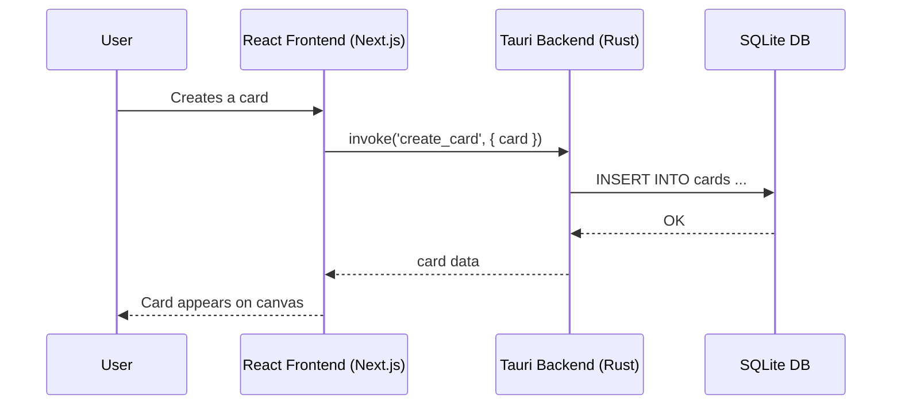

# CardCanvas — Complete Build & Deployment Guide

> A visual workspace for organizing cards, notes, links, and media on an infinite canvas.  
> Built with Next.js 16, React 19, TipTap, Excalidraw, Tauri 2, and SQLite.

---

## Table of Contents

1. [Project Overview](#1-project-overview)
2. [Prerequisites](#2-prerequisites)
3. [Local Development](#3-local-development)
4. [Desktop App Build (macOS, Windows, Linux)](#4-desktop-app-build)
5. [Automated CI/CD with GitHub Actions](#5-automated-cicd-with-github-actions)
6. [Architecture Deep Dive](#6-architecture-deep-dive)
7. [Project File Structure](#7-project-file-structure)
8. [Troubleshooting](#8-troubleshooting)

---

## 1. Project Overview

CardCanvas is a self-hosted infinite whiteboard where every sticky note is a card. It supports:

- 📝 **Rich Text Cards** — Full WYSIWYG editor with tables, task lists, formatting
- 🔗 **Link Cards** — Bookmark and preview URLs
- 🖼️ **Image Cards** — Upload or embed images
- 📄 **PDF Cards** — Embed and preview PDFs
- 🎨 **14-Color Palette** — Organize cards visually
- 🔍 **Search, Tags & Calendar Filtering** — Find anything fast
- 📁 **Folders & Boards** — Hierarchical workspace organization
- 🖌️ **Excalidraw Whiteboard** — Built-in drawing canvas
- 📦 **Runs anywhere** — macOS, Windows, Linux via Tauri

### Tech Stack

| Layer | Technology |
|-------|-----------|
| Frontend | React 19, Next.js 16 (Static Export), TipTap (WYSIWYG), Excalidraw |
| Backend | Rust Tauri Commands |
| Database | SQLite via `rusqlite` |
| Styling | Vanilla CSS (dark theme, glassmorphism) |
| Desktop | Tauri 2 |

---

## 2. Prerequisites

| Tool | Version | Required For |
|------|---------|-------------|
| **Node.js** | 18+ (recommended 20) | Frontend builds |
| **npm** | 9+ | Dependency management |
| **Rust** | Stable | Backend & Desktop app |

### Install Dependencies

```bash
# macOS (Homebrew)
brew install node@20
curl --proto '=https' --tlsv1.2 -sSf https://sh.rustup.rs | sh

# Verify
node --version
cargo --version
```

---

## 3. Local Development

### Step 1: Clone and install

```bash
git clone https://github.com/YOUR_USERNAME/cardcanvas.git
cd cardcanvas
npm install --legacy-peer-deps
```

> [!NOTE]
> `--legacy-peer-deps` is needed because some TipTap extensions have minor peer dependency version mismatches (3.22.4 vs 3.22.5). They work fine together.

### Step 2: Start the Tauri dev server

```bash
npm run tauri dev
```

This will compile the Rust backend and launch the Next.js frontend with hot-reloading inside a native desktop window.

### Where is data stored?

Your cards and uploads are stored securely on your local file system:

| OS | Location |
|------|----------|
| macOS | `~/Library/Application Support/com.cardcanvas.app/master.db` |
| Windows | `%APPDATA%\com.cardcanvas.app\master.db` |
| Linux | `~/.local/share/com.cardcanvas.app/master.db` |

---

## 4. Desktop App Build

To build a standalone installer (`.dmg`, `.exe`, `.deb`, `.AppImage`):

```bash
npm run tauri build
```

This command automatically:
1. Runs `next build` (which creates a static HTML export in the `out/` folder).
2. Compiles the Rust backend for release.
3. Bundles the assets into an installer.

**Output Location:**
```
src-tauri/target/release/bundle/
```

> [!WARNING]
> You cannot cross-compile Windows `.exe` from a macOS machine easily with Tauri. To build for Windows, build it on a Windows machine or use GitHub Actions.

---

## 5. Automated CI/CD with GitHub Actions

The project includes a GitHub Actions workflow at [`.github/workflows/build-desktop.yml`](file:///Users/mann/Documents/cardcanvas-desktop/cardcanvas-v3/.github/workflows/build-desktop.yml) that builds **all platforms natively** using Tauri's official action.

### How to trigger a release

```bash
# Tag a version
git tag v1.0.0
git push origin v1.0.0
```

### What it builds

| Runner | Output |
|--------|--------|
| `macos-latest` | macOS Universal (`.dmg`, `.app`) |
| `windows-latest` | Windows (`.exe`, `.msi`) |
| `ubuntu-22.04` | Linux (`.deb`, `.AppImage`) |

---

## 6. Architecture Deep Dive

### Data Flow



---

## 7. Project File Structure

```
cardcanvas/
├── .github/
│   └── workflows/
│       └── build-desktop.yml     # CI/CD for multi-platform builds
├── public/                       # Static assets
├── src/
│   ├── app/                      # Next.js routes and app shell
│   ├── components/               # React components (Canvas, Sidebar)
│   ├── lib/                      # Helper utilities
│   └── types/                    # TypeScript interfaces
├── src-tauri/                    # Rust backend and desktop app configuration
│   ├── src/                      # Rust source code
│   └── tauri.conf.json           # Tauri build config
├── next.config.ts                # Next.js configuration (static export)
├── package.json                  # Node dependencies & scripts
└── tsconfig.json                 # TypeScript config
```

---

## 8. Troubleshooting

### npm install fails with peer dependency errors

```bash
npm install --legacy-peer-deps
```

### Tauri build fails on Linux

Linux requires webkit2gtk and other native libraries to compile Tauri apps.
```bash
sudo apt-get update
sudo apt-get install -y libwebkit2gtk-4.1-dev libappindicator3-dev librsvg2-dev patchelf
```
