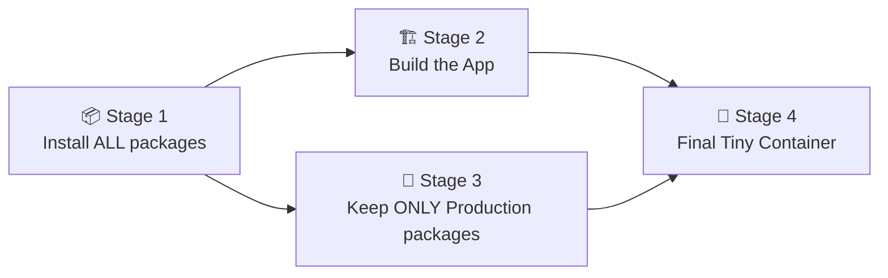

# 🎨 Welcome to CardCanvas! Your Learning Guide

> **CardCanvas** is a visual workspace for organizing cards, notes, links, and media on an infinite canvas.

Whether you are a developer looking to understand how the app works, or someone trying to deploy it for the first time, this guide is designed for *you*. We've used simple language, clear concepts, and beautiful formatting to make learning enjoyable!

---

## 🌟 What Can CardCanvas Do?

Imagine an infinite digital whiteboard where you can place sticky notes, but on steroids. Here is what is inside:

- 📝 **Rich Text Cards:** A full editor with tables and task lists (powered by TipTap).
- 🔗 **Link & Image Cards:** Bookmark URLs or upload images directly.
- 📄 **PDF Cards:** Embed and preview your PDF documents right on the board!
- 🎨 **14-Color Palette:** Color-code your thoughts for visual organization.
- 🔍 **Search & Tags:** Find exactly what you need, instantly.
- 📁 **Folders & Boards:** Keep your workspaces neatly organized.
- 🖌️ **Whiteboard Mode:** Draw and sketch freely (powered by Excalidraw).
- 📦 **Runs Anywhere:** Use it on the Web, via Docker, or as a native app on macOS and Windows.

---

## 🧠 Core Concepts Explained

Before we dive into setup, let's understand *how* CardCanvas works under the hood. 

### 1. The Frontend (What You See)
Built with **Next.js 16** and **React 19**. It uses **Vanilla CSS** for its beautiful dark theme and glassmorphism effects. For the rich text editor, it leverages **TipTap**, and for the drawing canvas, it uses **Excalidraw**.

### 2. The Backend & Database (Where Data Lives)
CardCanvas doesn't require a massive database setup. It uses **SQLite** (via `better-sqlite3`). This means your entire database is just a single file on your computer! Next.js "API Routes" handle the communication between the UI and this database file.

### 3. Desktop Apps (Electron)
To make CardCanvas run like a normal app on your computer, we use **Electron**. Electron wraps the Next.js web application in a native desktop window. 

> [!TIP]
> **Fun Fact:** Electron actually runs a hidden background process (Node.js) to manage your SQLite database locally, while showing you the visual app in a Chromium window!

---

## 🚀 How to Run CardCanvas Locally

Want to tinker with the code? Here's the easiest way to get started.

> [!IMPORTANT]
> You'll need **Node.js (version 20 is perfect)** installed on your computer.

### Step 1: Download and Install Dependencies
Open your terminal and run:
```bash
git clone https://github.com/YOUR_USERNAME/cardcanvas.git
cd cardcanvas
npm install --legacy-peer-deps
```
> [!NOTE]
> *Why `--legacy-peer-deps`?* Some of our rich text editor packages have slight version mismatches. This flag just tells npm, "It's okay, they still work together nicely!"

### Step 2: Start the Dev Server
```bash
npm run dev
```

### Step 3: Open the App
Go to **http://localhost:3000** in your browser. Any code changes you make will instantly show up! 

> [!TIP]
> **Where is my data?** If you create cards, they are saved locally on your computer in a file located at `./data/cardboard.db`. Your data is private!

---

## 🐳 Deploying with Docker (For Servers)

If you want to host CardCanvas on a server so you can access it from anywhere, **Docker** is your best friend. 

Docker packages the app and everything it needs to run into a single "container".

### The Magic Command
If you have Docker installed, just run:
```bash
docker compose up -d
```
Boom! The app is running on **http://localhost:3000**.

### How does the Docker build work?
We use a **multi-stage build** to keep the app lightweight:



---

## 💻 Building the Desktop App (macOS & Windows)

Want an actual `.dmg` or `.exe` file to install CardCanvas like a native app?

### For macOS
It's just one command:
```bash
npm run electron:build
```
This does all the hard work: building Next.js, copying the database modules, and packaging it up. The final file will be waiting for you in the `dist/` folder!

### For Windows
If you are on a Windows machine, the process is very similar! Just run the same commands, and `electron-builder` will create a `.exe` installer for you.

> [!WARNING]
> **Cross-compiling:** Don't try to build the Windows `.exe` file from a Mac! While the visual app will compile, the SQLite database needs to be built natively on Windows to function correctly. 

---

## 🛠️ Troubleshooting (Help, it broke!)

Here are quick fixes to common hiccups:

- **"Port 3000 is in use"**: Another app is running on port 3000. Stop it, or run CardCanvas on a different port: `PORT=3001 npm run dev`
- **Blank window in the Desktop App**: Make sure you start the Next.js development server (`npm run dev`) *before* you open the Electron app!
- **Data not saving on Windows**: If you built your `.exe` on a Mac, the database driver is incompatible. Build it on a Windows computer instead!

---

Enjoy exploring and building with **CardCanvas**! 🎉
